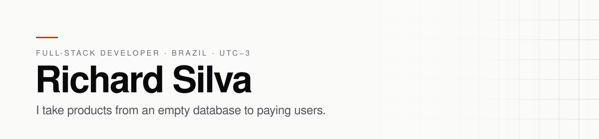

<picture>
  <source media="(prefers-color-scheme: dark)" srcset="assets/banner-dark.svg">
  <source media="(prefers-color-scheme: light)" srcset="assets/banner-light.svg">
  
</picture>

  

---

I build and operate software end to end — the data model, the interface on top of it, and the deploy that puts it in front of people.

Right now I work across the platforms at **Evolucional** in C# and .NET, and I design, build and run **[Progrida](https://progrida.app)** — a subscription SaaS that personal trainers use to prescribe training and export branded PDFs to their athletes.

**Open to freelance projects and remote contract work.**

## Selected work

### [Progrida](https://progrida.app) — live product

Subscription SaaS for personal trainers: build a training plan, publish it, and export a PDF carrying the trainer's own logo, colour and CREF licence number. It replaces the spreadsheet-and-screenshot workflow the profession still runs on.

Draft and published versions are kept apart, so an edit never reaches an athlete mid-week. White-label branding is baked into every export rather than bolted on as a setting.

`Next.js` · `React Server Components` · `TypeScript` · `Tailwind CSS` · `Supabase (Postgres)` · `Vercel`

### [hono-snowflake-ingestor](https://github.com/mockqv/hono-snowflake-ingestor) — open source

High-throughput ingestion API that validates JSON events with Zod and streams them into Snowflake's `VARIANT` columns — schema-on-read, so a new event shape never blocks on a migration. Returns `202 Accepted` immediately and persists in the background. Load-tested at 200+ req/s with 100/100 successful writes.

`Bun` · `Hono` · `TypeScript` · `Zod` · `Snowflake` · `Docker`

### [msc](https://github.com/mockqv/msc) — open source, MIT

A CLI that makes a well-formed commit the path of least resistance. Conventional Commits, git hooks, one command.

`Python` · `Shell`

## Stack

**Daily**

**Shipped with** — Next.js · Node.js · Python · Bun · Hono · Tailwind CSS · PostgreSQL · SQL Server · MongoDB · Supabase · Firebase · Docker · Linux
